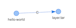
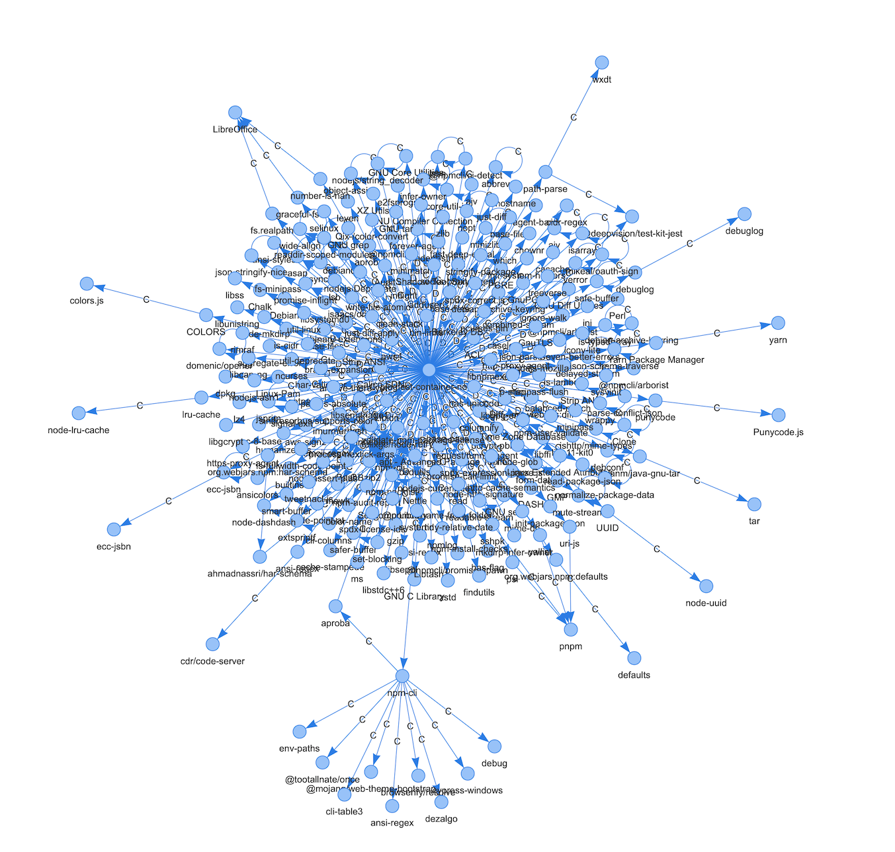

# SBOM Tools

## What is this?

Various initial hacks to explore SBOM data.

### sbom-detect.py 

Given a directory of inputs, crawl through and identify files which are likely to be SBOMs and identify format, standard, and version for each in JSON output

### sbom-analyze.py 

Given JSON input, parse SBOMs to identify minimum field presence and value differential across the input set.

### sbom-vis-*.py

Basic visualization of SBOM relationships via pyvis. 

### sbomlib

Multi-format multi-standard SBOM content sniffer and barebones parser.

Example usage:

           import sbomlib

           try: 
                s = sbomlib.BomSniffer(path) # Opens file and attempts to detect SBOM
                
                sbom = s.sbom # returns SBOM data if found

                if sbom is not None and 'standard' in sbom:
                    
                    p = sbom.get_parser() # get SBOM parser

                    pkg = p.get_packages() # get packages from SBOM

                    print("SBOM: {}::{} ".format(path, sbom))
                else:
                    print("NOTSBOM: {} ".format(path))

            except Exception as e:
                print("Exception when parsing {}".format(path))
                print(e)

## Why not use 'proper' parsers/libraries?

SBOM data may be incorrect or malformed. Instead of using heavyweight libraries, this code aims to extract salient identifying information without requiring full parsing of the data.

## TODO

Many things:

* Limit the graph/display to only N tiers of SBOM data for ease of navigation
* Check for presence/absence of 'required' SBOM fields and display in each node
* Support for SWID
* Support for SPDX XML
* Support for sub-components embeedded in CDX
* sbom-critic.py?
* ... 

## Examples

### sbom-checker.py

	+-------------------------+---------------------------------------------------+-------+-----+
	| Key                     | Explanation                                       | Count | %   |
	+-------------------------+---------------------------------------------------+-------+-----+
	| bom                     | Total # SBOMs found                               | 67    | 100 |
	| got_final_product       | Final product info was found                      | 62    | 93  |
	| packages                | SBOM packages found                               | 67    | 100 |
	| packages_with_ids       | SBOM packages which have the expected ID fields   | 67    | 100 |
	| packages_with_names     | SBOM packages which have the expected name fields | 67    | 100 |
	| relationships           | SBOM has relationships                            | 48    | 72  |
	| sbom_author             | SBOM has an author                                | 45    | 67  |
	| sbom_created            | SBOM has a creation date                          | 59    | 88  |
	| sbom_target             | SBOM has 'sbom of what' declared                  | 62    | 93  |
	| SpdxJsonSbom            | SPDX JSON Format                                  | 13    | 19  |
	| SpdxTvSbom              | SPDX Tag-Value Format                             | 38    | 57  |
	| only two relationships  | SBOM has only two relationship                    | 9     | 13  |
	| only one package        | SBOM has only one package                         | 18    | 27  |
	| files                   | SBOM has file-level resolution                    | 18    | 27  |
	| files_with_hashes       | File entries which have hashes                    | 18    | 27  |
	| packages_with_hashes    | SBOM has hashes at the component/package layer    | 26    | 39  |
	| packages_with_suppliers | SBOM packages that have supplier names            | 20    | 30  |
	| CdxXmlSbom              | Cyclone DX XML Format                             | 12    | 18  |
	| only one relationship   | SBOM has only one relationship                    | 12    | 18  |
	| CdxJsonSbom             | Cyclone DX JSON Format                            | 4     | 6   |
	+-------------------------+---------------------------------------------------+-------+-----+

### Simple

### Complex

